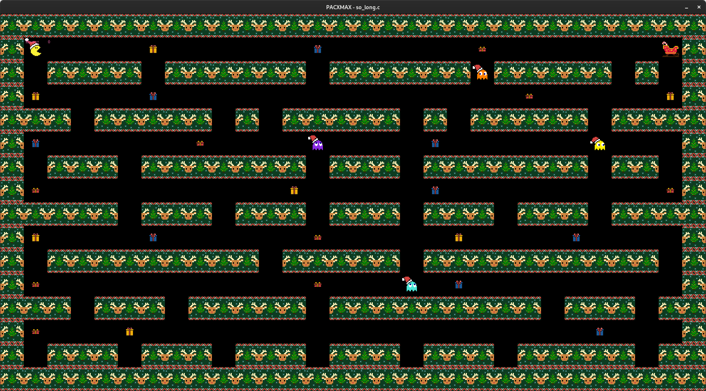

*This project has been created as part of the 42 curriculum by  mamarti.*

<div align="center">

</div>

# So Long


*(Illustration image)*

## Description

**So Long** is a 2D game developed in C with the **MiniLibX** library. The goal is to control a character, collect all items on the map, and reach the exit, while avoiding obstacles (and enemies in the bonus version).

This project allows you to get familiar with window management, keyboard/mouse events, texture rendering, and map parsing.

## Instructions

### Compilation

To compile the project:

```zsh
make
```

For the bonus (with enemies and animations):

```zsh
make bonus
```

### Usage

Launch the game by providing a \`.ber\` map file as an argument:

```zsh
./so_long maps/goodmaps/map.ber
```

#### Controls

| Key            | Action                        |
| :------------: | :---------------------------- |
| \`W\` / \`↑\`      | Move Up                       |
| \`S\` / \`↓\`      | Move Down                     |
| \`A\` / \`←\`      | Move Left                     |
| \`D\` / \`→\`      | Move Right                    |
| \`ESC\`          | Quit the game                 |
| \`Red Cross\`    | Quit the game (close window)  |

### Cleaning

To remove object files & dependencies:

```zsh
make clean
```

To remove all binaries, object files & dependencies:

```zsh
make fclean
```

To recompile completely:

```zsh
make re
```

## Features

### Mandatory Part
- Character movement in 4 directions (Up, Down, Left, Right)
- Wall collision handling
- Item collection (Collectibles)
- Exit unlocked only after collecting everything
- Basic error handling (invalid map, missing file, etc.)
- Movement count display in the terminal

### Bonus Part
- Animations: Animated sprites for the player and/or objects
- Enemies (Mobs): Patrols that kill the player on contact
- Movement counter displayed on the screen

## Map Format

Maps must be in \`.ber\` format and comply with the following rules:
- The map must be rectangular
- It must be closed by walls (\`1\`)
- It must contain at least:
  - 1 Start (\`P\`)
  - 1 Exit (\`E\`)
  - 1 Item to collect (\`C\`)

Valid map example:
```
1111111111111
10010000000C1
1000011111001
1P0011E000001
1111111111111
```

## Prerequisites

### Linux
Install the necessary packages for MiniLibX:

```zsh
sudo apt-get update
sudo apt-get install gcc make xorg libxext-dev libx11-dev zlib1g-dev
```

### macOS
Install **Xcode Command Line Tools**:

```zsh
xcode-select --install
```

> **Note**: Use the MiniLibX version adapted to your OS (\`minilibx-linux\` or \`minilibx-macos\`).

## Project Structure

- \`srcs/\`: Source code for the mandatory part
- \`bonus/srcs/\`: Source code for the bonus part
- \`includes/\`: Header files (.h)
- \`libft/\`: Libft library
- \`minilibx-linux/\`: MiniLibX (Linux)
- \`minilibx-opengl/\`: MiniLibX (macOS)
- \`assets/\`: Graphic resources
  - \`collectibles/\`: Item sprites
  - \`exit/\`: Exit sprites
  - \`mobs/\`: Enemy sprites
  - \`pacmans/\`: Player sprites
- \`maps/\`: Map examples
  - \`goodmaps/\`: Valid maps
  - \`badmaps/\`: Invalid maps (tests)
  - \`bonus/\`: Maps for the bonus part

## Resources

- [MiniLibX — 42Docs](https://harm-smits.github.io/42docs/libs/minilibx)
- [Event handling in C](https://www.geeksforgeeks.org/handling-events-in-c/)
- [2D Sprites and animations](https://www.piskelapp.com/)

## Additional Information

- Language: C
- External library: \`libft\` provided
- Compliance with 42 coding standards

## Author

- **mamarti**

---

*Ce projet a été réalisé dans le cadre du cursus 42 par mamarti.*

# So Long


*(Image d'illustration)*

## Description

**So Long** est un jeu 2D développé en C avec la bibliothèque **MiniLibX**. Le but est de contrôler un personnage, ramasser tous les objets de la carte et rejoindre la sortie, tout en évitant les obstacles (et les ennemis dans la version bonus).

Ce projet permet de se familiariser avec la gestion de fenêtres, les événements clavier/souris, le rendu de textures et le parsing de cartes.

## Instructions

### Compilation

Pour compiler le projet :

```zsh
make
```

Pour le bonus (avec ennemis et animations) :

```zsh
make bonus
```

### Utilisation

Lancez le jeu en fournissant un fichier de carte `.ber` en argument :

```zsh
./so_long maps/goodmaps/map.ber
```

#### Contrôles

| Touche         | Action                        |
| :------------: | :---------------------------- |
| `W` / `↑`      | Déplacer vers le Haut         |
| `S` / `↓`      | Déplacer vers le Bas          |
| `A` / `←`      | Déplacer vers la Gauche       |
| `D` / `→`      | Déplacer vers la Droite       |
| `ESC`          | Quitter le jeu                |
| `Croix Rouge`  | Quitter le jeu (fermer fenêtre) |

### Nettoyage

Pour supprimer les fichiers objets & dépendances :

```zsh
make clean
```

Pour supprimer tous les binaires, fichiers objets & dépendances :

```zsh
make fclean
```

Pour recompiler entièrement :

```zsh
make re
```

## Fonctionnalités

### Partie Obligatoire
- Déplacement du personnage dans 4 directions (Haut, Bas, Gauche, Droite)
- Gestion des collisions avec les murs
- Collecte d'objets (Collectibles)
- Sortie déverrouillée uniquement après avoir tout collecté
- Gestion basique des erreurs (carte invalide, fichier manquant, etc.)
- Affichage du nombre de mouvements dans le terminal

### Partie Bonus
- Animations : Sprites animés pour le joueur et/ou les objets
- Ennemis (Mobs) : Patrouilles qui tuent le joueur au contact
- Compteur de mouvements affiché à l'écran

## Format de la Carte

Les cartes doivent être au format `.ber` et respecter les règles suivantes :
- La carte doit être rectangulaire
- Elle doit être fermée par des murs (`1`)
- Elle doit contenir au moins :
  - 1 Départ (`P`)
  - 1 Sortie (`E`)
  - 1 Item à collecter (`C`)

Exemple de carte valide :
```
1111111111111
10010000000C1
1000011111001
1P0011E000001
1111111111111
```

## Prérequis

### Linux
Installer les paquets nécessaires pour MiniLibX :

```zsh
sudo apt-get update
sudo apt-get install gcc make xorg libxext-dev libx11-dev zlib1g-dev
```

### macOS
Installer les **Xcode Command Line Tools** :

```zsh
xcode-select --install
```

> **Note** : Utilisez la version MiniLibX adaptée à votre OS (`minilibx-linux` ou `minilibx-macos`).

## Structure du Projet

- `srcs/` : Code source de la partie obligatoire
- `bonus/srcs/` : Code source de la partie bonus
- `includes/` : Fichiers d'en-tête (.h)
- `libft/` : Bibliothèque libft
- `minilibx-linux/` : MiniLibX (Linux)
- `minilibx-opengl/` : MiniLibX (macOS)
- `assets/` : Ressources graphiques
  - `collectibles/` : Sprites des objets
  - `exit/` : Sprites de la sortie
  - `mobs/` : Sprites des ennemis
  - `pacmans/` : Sprites du joueur
- `maps/` : Exemples de cartes
  - `goodmaps/` : Cartes valides
  - `badmaps/` : Cartes invalides (tests)
  - `bonus/` : Cartes pour la partie bonus

## Ressources

- [MiniLibX — 42Docs](https://harm-smits.github.io/42docs/libs/minilibx)
- [Gestion d'événements en C](https://www.geeksforgeeks.org/handling-events-in-c/)
- [Sprites et animations 2D](https://www.piskelapp.com/)

## Informations complémentaires

- Langage : C
- Bibliothèque externe : `libft` fournie
- Respect des normes de codage 42

## Auteur

- **mamarti**
